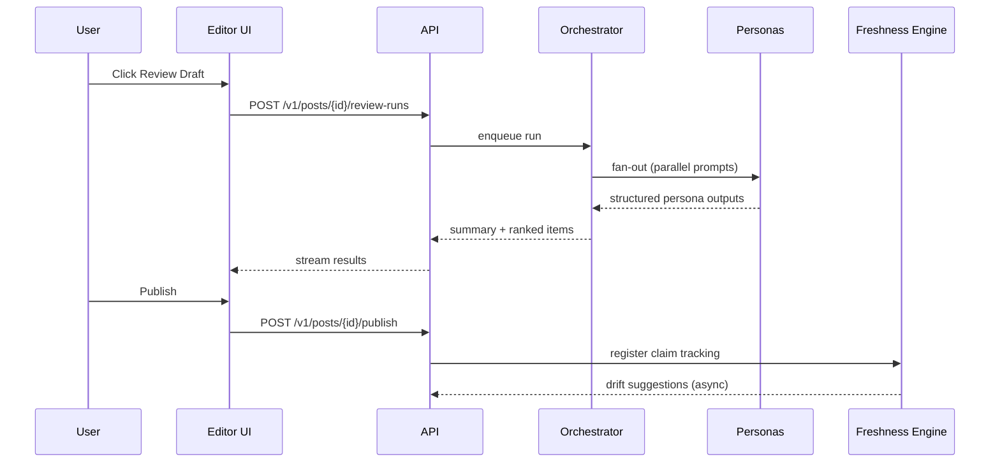

# Orchestrator Flow (V1)

Last updated: February 27, 2026

## Runtime stages

1. Input normalization.
2. Voice/style profile retrieval.
3. Persona fan-out in parallel.
4. Output normalization to shared schema.
5. Aggregation and deduplication.
6. Conflict grouping and tradeoff card generation.
7. Prioritization into Now/Soon/Optional.
8. Stream digest then full details to UI.

## Conflict handling

- Detect contradictory suggestions on same text span or claim.
- Generate one tradeoff card with:
  - Option A summary
  - Option B summary
  - Decision guidance by user goal

## Freshness orchestration

1. Claim extractor runs at publish time.
2. Scheduler sets monitoring cadence by volatility.
3. Check runner compares claims with trusted sources.
4. Drift classifier emits `freshness_update` records.
5. Dashboard queues approval actions.

## Guardrails

- Never auto-apply edits to published posts.
- Always attach check date in reader-facing notices.
- Require provenance for high-confidence factual suggestions.

## Reference sequence diagram

